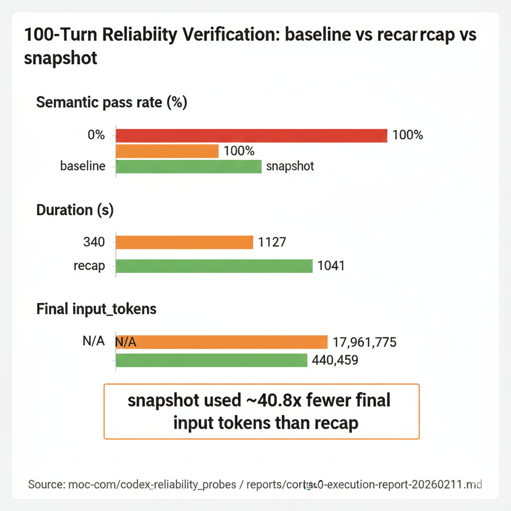
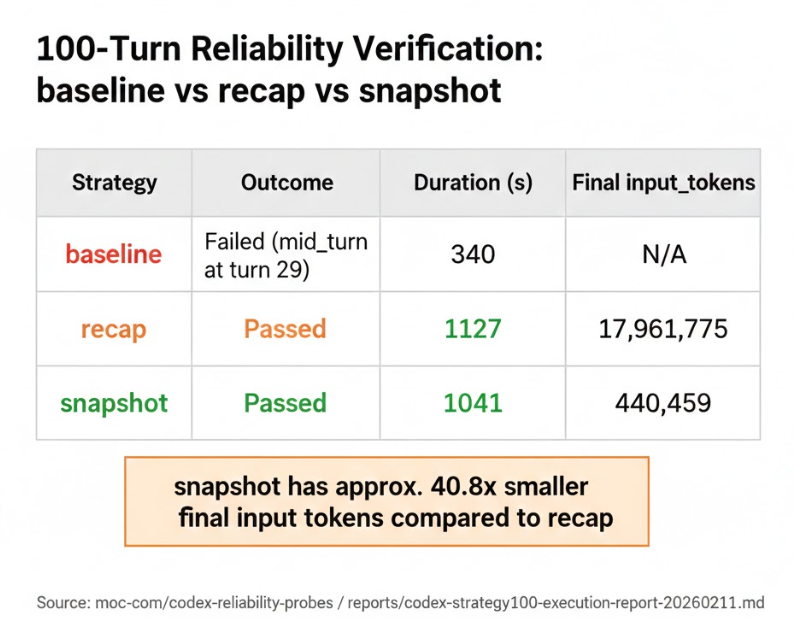
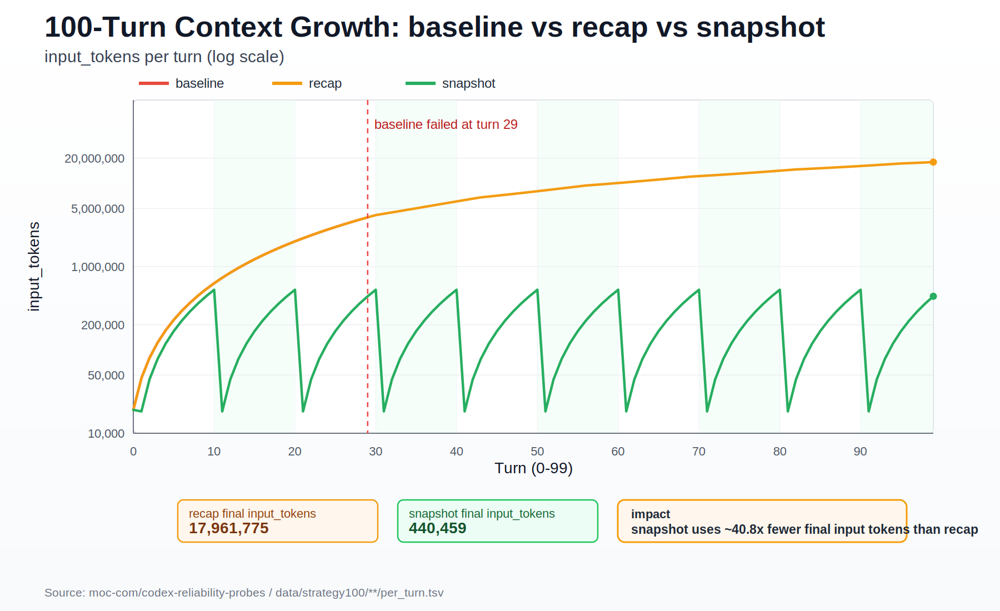

# Codex Reliability Probes (Deterministic Exact-Match)

This repository shares reproducible reliability probe artifacts on `gpt-5.3-codex`.

## Status

- Current status: **v1 frozen** (2026-02-12).
- Maintainer policy from this point: no large new benchmark sweeps by default.
- Next phase is community-driven extension under explicit reproducibility rules.

## Reports

- `reports/report_codex_benchmark_20260211_singlefile_full_30k.md` (Japanese)
- `reports/report_codex_benchmark_20260211_singlefile_full_30k_en.md` (English)
- `reports/codex-turn-budget-decision-20260211.md`
- `reports/codex-strategy100-execution-report-20260211.md`
- `reports/v1-freeze-handoff-20260212.md`
- `reports/v2-experiment-plan-template.md`

## Figure





## New Strategy-100 Dataset (baseline vs recap vs snapshot)

Raw outputs:
- `data/strategy100/baseline/`
- `data/strategy100/recap/`
- `data/strategy100/snapshot/`
- `data/task_matrix_v2.tsv` (v2 external-validity task matrix)

Runner:
- `scripts/codex_final_recall_probe.sh`

Measured result (100 turns, 1 trial each):

| Strategy | Strict | Semantic | Outcome |
|---|---:|---:|---|
| baseline | 0/1 | 0/1 | failed at turn 29 (mid-turn) |
| recap (every 10 turns) | 1/1 | 1/1 | pass |
| snapshot (every 10 turns) | 1/1 | 1/1 | pass |

Cost signal from this run:
- `recap` final-turn `input_tokens`: `17,961,775`
- `snapshot` final-turn `input_tokens`: `440,459`
- `snapshot` context footprint was about `40.8x` smaller than `recap` at final turn.

## Limitations (v1)

- Statistical power is limited in `strategy100` (single trial per strategy).
- The task family is controlled and narrow (exact-match oriented), not a universal coding benchmark.
- Pricing, throughput under concurrency, and rate-limit stress are not fully benchmarked in v1.
- Causal claims about *why* failures happen are out of scope for v1.

## Community Roadmap (v2+)

1. Increase repetition (`n>=10` per condition) and publish confidence intervals + survival analysis.
2. Add explicit model/runtime parameter capture and lock policies in manifests.
3. Add cost conversion (`USD/run`) and throughput/rate-limit metrics.
4. Add drift-focused evaluation for snapshot compression loss.
5. Add broader external-validity scenarios (multi-task interference, requirement churn).

Reference utilities prepared for this roadmap:
- `scripts/codex_final_recall_probe.sh` (scenario/event metadata support)
- `scripts/analyze_strategy_suite_v2.py` (CI/survival/cost-throughput/drift summaries)

## Contributing

Please read `CONTRIBUTING.md` before opening a PR.

## Reproduce (CLI)

```bash
# baseline
scripts/codex_final_recall_probe.sh \
  --strategy baseline \
  --plan 100x1 \
  --max-input-tokens 20000000 \
  --max-delta-input-tokens 300000

# recap (every 10 turns)
scripts/codex_final_recall_probe.sh \
  --strategy recap \
  --recap-interval 10 \
  --plan 100x1 \
  --max-input-tokens 20000000 \
  --max-delta-input-tokens 300000

# snapshot (every 10 turns)
scripts/codex_final_recall_probe.sh \
  --strategy snapshot \
  --snapshot-interval 10 \
  --plan 100x1 \
  --max-input-tokens 20000000 \
  --max-delta-input-tokens 300000

# render line chart from raw per_turn.tsv
python3 scripts/render_strategy100_context_growth_line_svg.py

```

## Operational Guidance

- Recommended validation set: `baseline@100`, `recap@100`, `snapshot@100`.
- Routine stop-line: `<=100 turns`.
- For routine operation, avoid `>100` unless running an explicit budget-approved stress test.

## What This Is (Why It Matters)

- This is a controlled reliability probe for long-turn operation, not a general coding benchmark.
- The core question is: which orchestration pattern preserves exact recall while controlling context cost?
- Main outcome from this dataset:
  - `baseline` failed early (turn 29).
  - `recap` and `snapshot` both reached 100 turns.
  - `snapshot` achieved the same reliability with dramatically lower context footprint.

## Model/Workflow Improvement Levers

If the goal is higher real-world reliability per token budget, prioritize these levers:

1. Thread segmentation by design (`snapshot` pattern)
- Reset thread state every fixed interval (for example every 10 turns).
- Carry only compact state forward (token/checkpoint + required constraints).
- This directly controls context growth and reduces late-turn instability.

2. Periodic memory anchoring (`recap` pattern)
- Re-state critical invariants at fixed cadence.
- Useful when single-thread continuity is required, but expect higher token cost than snapshot.

3. Hard budget guardrails
- Stop or rotate strategy when `input_tokens` or per-turn delta exceeds threshold.
- Treat guardrails as part of correctness, not only cost control.

4. Failure-type-aware QA
- Separate `mid_turn` failures from `final_recall` failures.
- Different failure types require different mitigations (state reset, recap cadence, prompt tightening).

5. Increase statistical confidence
- Current run count is intentionally small.
- Recommended next step: repeat each strategy with `n>=5` (or `n>=10`) and publish confidence intervals.

## Notes

- These are controlled reliability probes, not universal benchmarks.
- Sample size is still small; treat this as a reproducibility package and baseline for follow-up trials.
